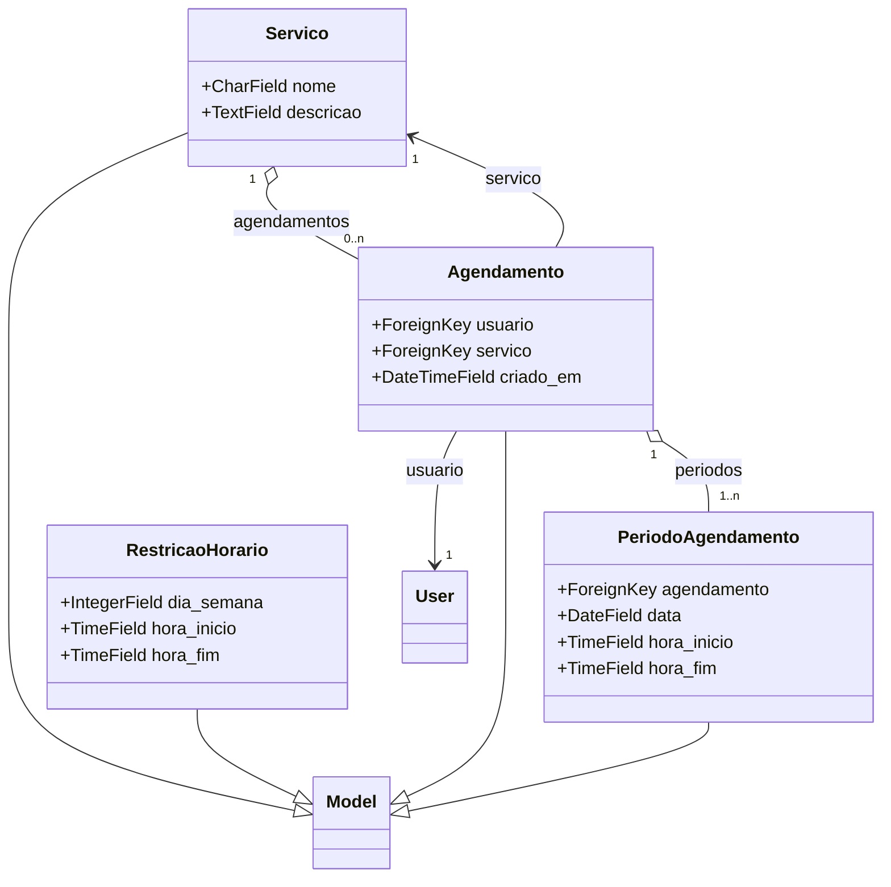

```mermaid
classDiagram
    class Servico {
        +CharField nome
        +TextField descricao
    }
    class RestricaoHorario {
        +IntegerField dia_semana
        +TimeField hora_inicio
        +TimeField hora_fim
    }
    class Agendamento {
        +ForeignKey usuario
        +ForeignKey servico
        +DateTimeField criado_em
    }
    class PeriodoAgendamento {
        +ForeignKey agendamento
        +DateField data
        +TimeField hora_inicio
        +TimeField hora_fim
    }
    class User
    class Model

    Servico --|> Model
    RestricaoHorario --|> Model
    Agendamento --|> Model
    PeriodoAgendamento --|> Model

    Agendamento --> "1" User : usuario
    Agendamento --> "1" Servico : servico
    Servico "1" o-- "0..n" Agendamento : agendamentos
    Agendamento "1" o-- "1..n" PeriodoAgendamento : periodos
```