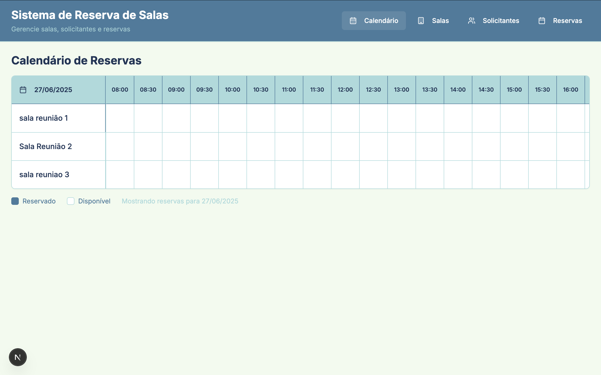
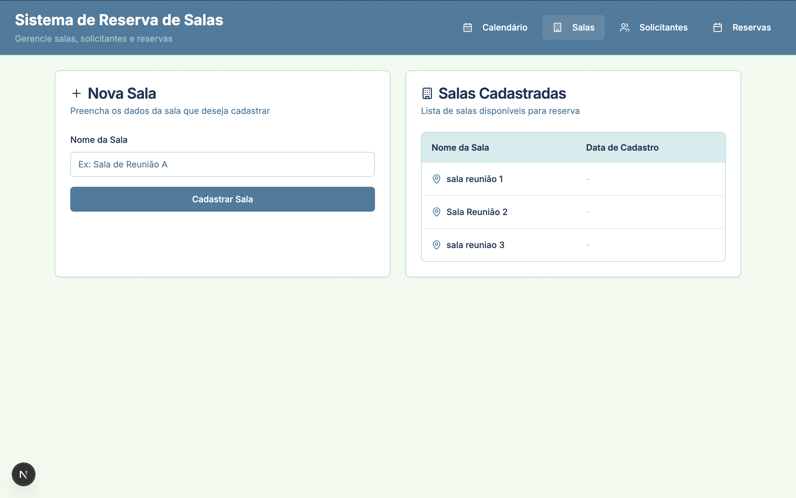
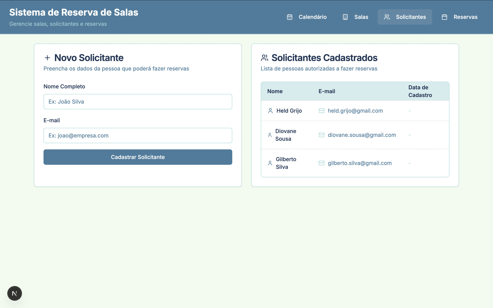
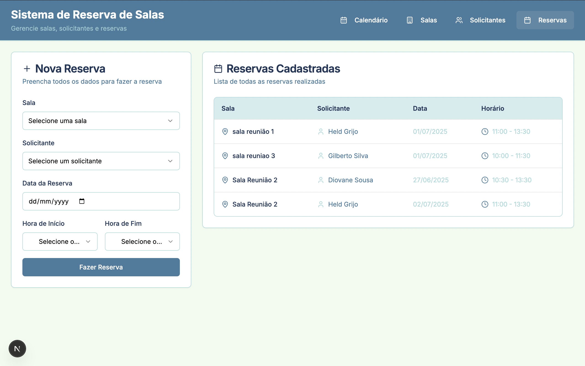

# Reserva de Salas - Aplicação Web

Esta aplicação permite o cadastro e a visualização de reservas de salas de forma simples e eficiente. Desenvolvida com Next.js, React e TypeScript, ela oferece uma interface moderna e responsiva para facilitar o gerenciamento de reservas em ambientes corporativos, educacionais ou de coworking.

## Funcionalidades

- Cadastro de reservas informando sala, solicitante, data e horários.
- Visualização de todas as reservas em lista.
- Visualização de calendário de reservas por sala e horário.
- Validação de conflitos e campos obrigatórios.
- Suporte a dados mock para demonstração e testes.
- Interface amigável e responsiva.

## Como executar

1. Instale as dependências:
   ```bash
   npm install
   ```

2. Inicie o servidor de desenvolvimento:
   ```bash
   npm run dev
   ```

3. Acesse [http://localhost:3000](http://localhost:3000) no navegador.

## Screenshots

Veja abaixo exemplos de telas da aplicação:

### Calendário de Reservas



### Formulário de Novas Salas



### Formulário de Novos Solicitantes



### Formulário de Nova Reserva



## Estrutura

- `app/` - Páginas e componentes principais da aplicação.
- `lib/` - Funções utilitárias, mocks e configuração de API.
- `screenshots/` - Imagens de exemplo da interface (na raiz do projeto).

## Tecnologias

- Next.js
- React
- TypeScript
- Tailwind CSS
- Radix UI
- Lucide Icons

## Observações

- O modo demonstração pode ser ativado/desativado via a variável `USE_MOCK_DATA` em `/lib/api.ts`.
- O projeto está pronto para integração com APIs reais ou uso de dados mock.

---
